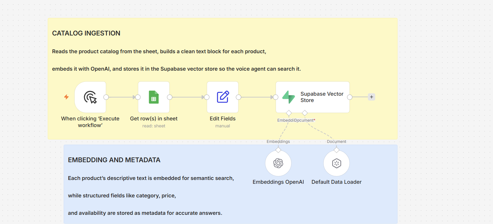
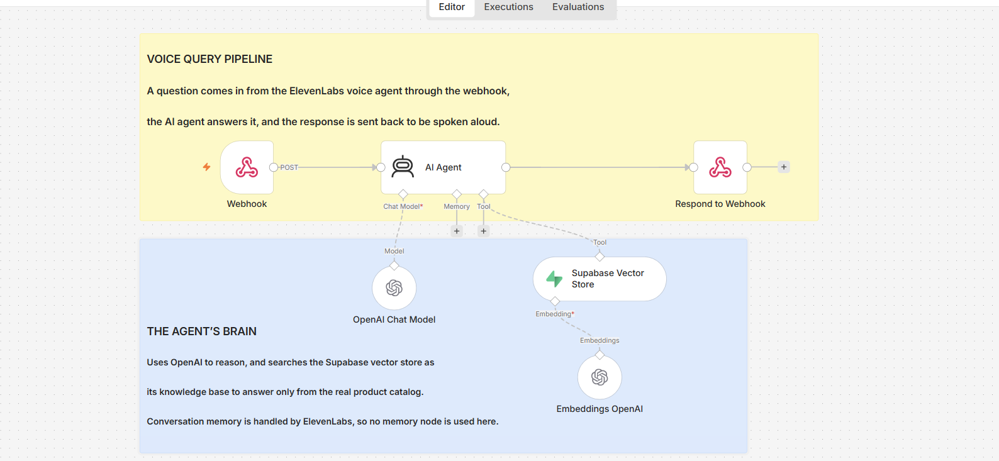
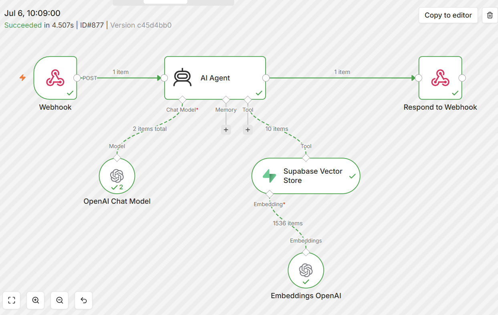
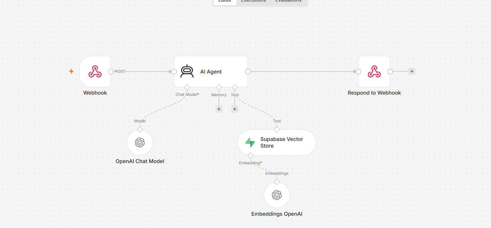
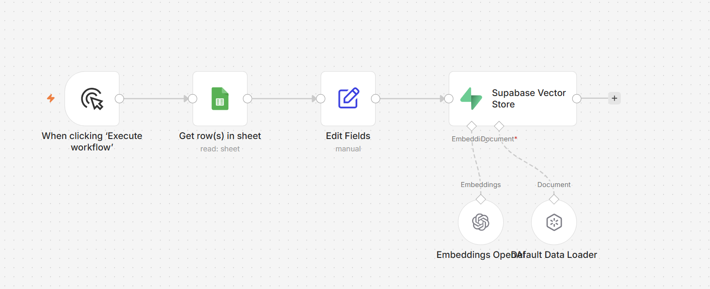

# Voice RAG Sales Agent

Imagine calling an online store and simply asking, out loud, "I need something quiet for a shared office." A moment later a friendly voice answers with two real products, their exact prices, whether they are in stock, and why each one fits. No menus, no typing, no waiting on hold. Just a conversation, the way you would talk to a good salesperson standing behind the counter.

That is what this project does. It is an AI voice sales agent for an online computer accessories store. A customer speaks, an ElevenLabs voice agent listens, and behind the scenes an n8n workflow searches a real product catalog and answers grounded only in what the store actually sells.

Built on n8n with OpenAI, Supabase, and ElevenLabs.

---

## Watch It In Action

The demo videos show the agent handling real conversations, both the everyday questions and the tricky edge cases that expose whether a system can be trusted.

[Watch the demo videos](https://drive.google.com/drive/folders/1FXw9UkqXs5Efc5gRZExzEBhWeKAGO0EP?usp=sharing)

---

## The Problem

A customer talking to a sales agent expects real answers. What is the price. Is it in stock. What would you recommend for gaming. The danger with an AI answering these questions is that a language model, left on its own, will happily invent a product, guess a price, or confidently describe specifications that do not exist. Over voice this is even riskier, because there is no screen for the customer to double check what they heard.

So the whole project is built around one principle. The agent may only answer from the store's real catalog. It looks up real products, quotes real prices, reports real stock, and when it does not have something, it says so instead of making something up. This is what separates a helpful assistant from a liability.

---

## How It Works

The system is built as two workflows. One prepares the knowledge. The other answers the customer. They are kept separate because they do completely different jobs at completely different times.

---

### Why RAG

The agent needs to answer questions about a specific product catalog that no language model was trained on. The technique for this is RAG, which stands for Retrieval Augmented Generation. Instead of relying on what the model happened to learn, the agent retrieves the relevant products from a real database at the moment of the question, and answers using only that. This is what keeps every answer grounded in the store's actual inventory.

---

### Workflow 1: Catalog Ingestion

Before the agent can answer anything, the product catalog has to be turned into something searchable by meaning. This workflow does that.

The catalog lives in a spreadsheet, because a spreadsheet is easy for a human to read and edit. But a spreadsheet cannot be searched by meaning, only by exact text. So this workflow reads every product from the sheet, builds a clean descriptive text block for each one, and hands it to the vector store.

**Why Supabase.** The products are stored in Supabase, a database with vector support. Storing each product as a vector, which is a numerical representation of its meaning, is what allows the agent to later search by intent rather than exact keywords. When a customer asks for something quiet for an office, the search can find the right products even though the word quiet may appear nowhere in a product's name.

**What the Default Data Loader does with the metadata.** Each product is split into two parts on the way in. The descriptive text, the part a customer would care about, is embedded so it can be found by semantic search. The structured fields, such as category, price, and availability, are stored alongside as metadata. The descriptive text answers "which product fits this need." The metadata carries the exact facts the agent then quotes back. Descriptive text for finding, structured fields for stating.

---

### Workflow 2: The Voice Query Pipeline

This is the workflow that runs every time a customer speaks.

A question comes in from the ElevenLabs voice agent as a web request to a webhook. The n8n AI agent receives it, searches the Supabase catalog for the relevant products, forms a grounded answer, and sends it back through the response so ElevenLabs can speak it aloud.

**The agent's brain.** The agent uses OpenAI to reason, and it treats the Supabase vector store as its only source of product knowledge. It is instructed to quote prices and stock exactly, to recommend gracefully when an item is out of stock, and never to invent a product it cannot find.

**Why there is no memory node.** A sales conversation is multi turn. A customer might ask about two keyboards, then say "tell me more about the second one." That requires memory. But the memory is handled by ElevenLabs itself, which keeps the conversation history on its side. Adding a second memory inside n8n would duplicate that and actually break the agent, so the n8n side is deliberately left stateless.

---

## Seeing It Work

### A Successful Run

Here is the voice query workflow executing end to end. The question arrives at the webhook, the agent searches the Supabase catalog, and a grounded answer is sent back, all in a few seconds.

---

### The Voice Query Workflow

The full query pipeline on the canvas, from the incoming webhook to the answer sent back to be spoken.

---

### The Catalog Ingestion Workflow

The ingestion pipeline that reads the catalog, embeds each product, and loads it into the Supabase vector store.

---

## How It Handles the Tricky Stuff

Clean questions are easy. The real test of a sales agent is the messy cases. A customer asking for a product that does not exist. A product that is out of stock. A made up model name that sounds real. A false claim about specifications. A question that has nothing to do with the store.

I tested all of these. The agent refused to invent a fake product, corrected a false specification claim from the real catalog, handled an out of stock item by offering a genuine in stock alternative, and politely declined a question that was outside its scope. The edge case video shows each of these in action.

---

## Design Decisions

**RAG for grounding.** The agent answers only from the real catalog stored in Supabase, so it cannot invent products, prices, or stock. For a sales agent, trust is everything.

**Two workflows, two jobs.** Ingestion prepares the knowledge base and runs when the catalog changes. The query pipeline answers customers and runs on every question. Different jobs, different triggers, kept as separate workflows.

**The spreadsheet is the human source, Supabase is the searchable brain.** The catalog stays in a sheet so it is easy to edit, and is transferred into Supabase so it can be searched by meaning. Each side does what it is best at.

**Content for meaning, metadata for facts.** Descriptive text is embedded for semantic search, while exact fields like price and availability are stored as metadata, so the agent can both find the right product and quote its real details.

**Memory lives in ElevenLabs, not n8n.** The voice platform already tracks the conversation, so the n8n agent is kept stateless to avoid duplicating and breaking that.

---

## Features I Used

- **n8n:** the workflow engine and the AI agent framework
- **OpenAI:** agent reasoning and the embeddings that power semantic search
- **Supabase vector store:** the searchable product knowledge base
- **ElevenLabs:** the voice front end and the conversation memory
- **RAG (Retrieval Augmented Generation):** grounding every answer in the real catalog
- **Webhooks:** connecting the ElevenLabs voice agent to the n8n workflow
- **Google Sheets:** the human editable product catalog that feeds ingestion

---

## Try It Yourself

You can import and run this project in your own n8n:

1. Download the two workflow files from the `json-files` folder (AgenticRAG.json and Eccomerce Data Ingest.json).
2. In your own n8n, import each one (Workflows, then import from file).
3. Connect your own credentials: an OpenAI account for the agent and embeddings, and a Supabase project for the vector store.
4. Set up a Supabase table for the product vectors, then run the ingestion workflow to load the catalog from the sheet.
5. Connect the query workflow's webhook to an ElevenLabs voice agent, and start talking.

The product catalog used here is included in the `knowledge-base` folder as Products-KB.xlsx, so you can load the same data.

There is no live public link to talk to, since that would mean keeping my own workflow, catalog, and credentials running publicly. Importing the workflows lets you run the whole system on your own setup.

---

## Files

- `json-files/` the two workflows, the voice query pipeline (AgenticRAG) and the catalog ingestion (Eccomerce Data Ingest)
- `knowledge-base/` the product catalog used as the knowledge base (Products-KB.xlsx)
- `workflows/` the labeled and plain canvases for both workflows
- `successful-executions/` a successful run of the voice query workflow

*Note: API keys and credentials have been removed from the exported workflows. To run this yourself, connect your own OpenAI and Supabase credentials in n8n.*
